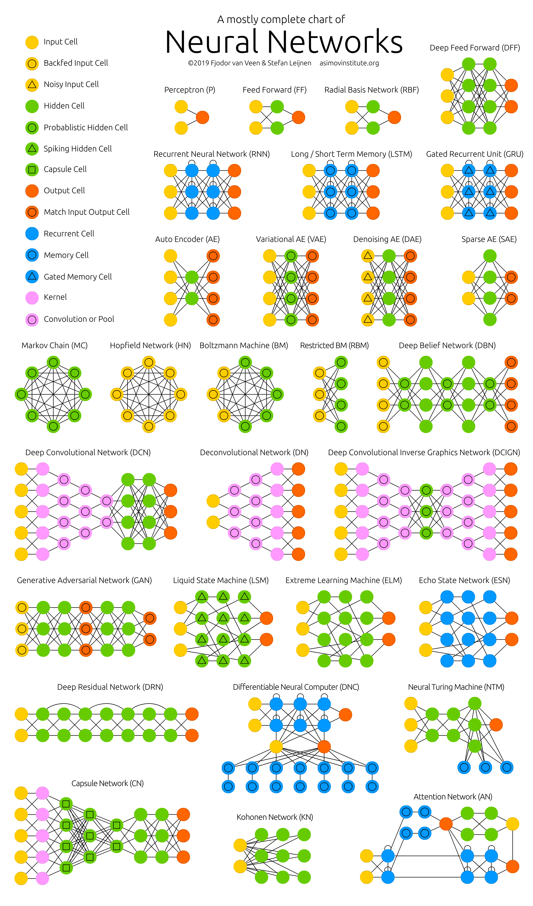

==============
腾讯觅影赛道四
==============

虽然代码无法下载到本地，但是，使用 Jupyter notebook 可以直接在云端查看图片是什么样子的。

相关链接
--------

- `【记得及时终止和删除】智能钛机器学习平台 <https://console.cloud.tencent.com/tione/notebook/instance>`_
- `查看比赛数据 <https://console.cloud.tencent.com/taop/project-data>`_
- `常见问题之 Notebook 功能相关 <https://cloud.tencent.com/developer/article/1876374>`_
- `大赛介绍与赛事教程汇总 <https://cloud.tencent.com/developer/special/AIMIS2021-TIONE>`_
- `如何使用 Notebook 功能完成赛事训练 <https://cloud.tencent.com/developer/article/1876370>`_
- `赛道四题目介绍和数据说明 <https://contest.taop.qq.com/channelDetail?id=108>`_
- `腾讯觅影大赛首页 <https://contest.taop.qq.com>`_
- `如何使用数据 <https://www.kaggle.com/>`_
- `从哪里找参考模型 <https://paperswithcode.com/search?q_meta=&q_type=&q=3D+Unet>`_

任务分析
--------

考虑这样一个手工标注或操作场景：在肿瘤患者接收放射治疗之前， **放疗医生** 需要做什么？

- 在 CT 影像上 **手工勾画** 出肿瘤及肿瘤周边的正常组织（如肺、心脏等），这对应 8 个 Segmentation 的 nii.gz 文件
- 对不同的区域给出相应的 **处方剂量** ，处方剂量包括：
    
  - 肿瘤区域（以下称为靶区或 PTV）至少需要辐射的剂量，使靶区能得到有效的控制
  - 靶区周边的正常组织的最大辐照剂量，以减少正常组织的放射性副反应

- 勾画完成后，设计放疗机器的参数，以满足放疗计划（这是 **物理师** 做的）。

一个完整的放疗计划包括：1）CT 影像，2）勾画图（靶区和正常结构），3）放疗剂量图，4）计划信息文件

现在的任务是利用现有的临床数据，建立放疗计划的 **三维剂量预测模型** 。模型可以根据患者的 **CT 影像图、勾画图** 来预测其放疗计划的 **三维剂量图** 。

物理师可以根据模型所预测的三维剂量图预先得知靶区和正常组织的剂量情况，在计划设计之前做到心中有数，对计划优化时有针对性地进行优化条件设置，
减少计划设计的试错次数，另外预测剂量对计划完成后的计划审查也有重要意义。

目标分析
~~~~~~~~

根据任务分析，现在需要让机器代替人工操作，CT 影像图、勾画图是已知的，三维剂量图是需要预测的。

结果验证
~~~~~~~~

标注回传或提交作品

如何提交预测结果？
~~~~~~~~~~~~~~~~~~

1. 将病理结果汇总清单 04_predicts.csv 及对应的预测 dose 文件 {id_patient}_RTdose.nii.gz 打包 [12]_ 为 04_predicts.zip。
2. 将压缩包复制到 ``/home/tione/notebook/taop-2021-result/04_predicts/<unix_timestamp>/04_predicts.zip`` [13]_ 。
3. 在 `大赛官网个人信息页 <https://contest.taop.qq.com/personalInfo>`_ 中，标注回传 04_predicts.zip，比对预测结果，调整模型参数。
4. 用同样的方式对 04_results.csv 进行打包 [12]_ ，在 `大赛官网个人信息页 <https://contest.taop.qq.com/personalInfo>`_ 中，提交作品 04_results.zip，进行排名更新。

.. rubric:: 注

.. [12] 文件打包直接在 04_predicts.csv 文件所在目录下执行 ``zip -q -r 04_predicts.zip *`` 即可，请勿加入当前目录信息。
.. [13] ``<unix_timestamp>`` 为选手自行生成的时间戳。

.. note:: 
    
    每位选手每日可提交 10 次标注回传，3 次提交作品。
    
    需要提交的压缩包目录结构示意如下：

    .. code-block:: text
    
        04_results.zip
            |-- 04_results.csv
            |-- 320_RTdose.nii.gz
            |-- 321_RTdose.nii.gz

目录结构分析
------------

在 ``/home/tione/notebook/taop-2021/100004`` 文件夹下，是赛道四能够用到的所有的数据。

.. code-block:: text

    id_project
        |-- train1_data_info.csv # 每个样本 10 行，8 勾画图，1 放射剂量图，1 CT 影像目录
        |-- test1_data_info.csv # 包含除放射剂量图 dose 文件的 file_path 之外的信息
        |-- dose_origin_spacing_size_01.csv # 用于配准
        |-- 04_results.csv # 最后需要提交的作品，用于排名
        |-- {id_patient} # 病人 id，总共 350 个文件夹
                |-- {id_patient}_Total_Lung.nii.gz # 勾画图
                |-- {id_patient}_Spinal-Cord.nii.gz
                |-- {id_patient}_RTdose.nii.gz
                |-- {id_patient}_R_Lung.nii.gz
                |-- {id_patient}_PTV.nii.gz
                |-- {id_patient}_L_Lung.nii.gz
                |-- {id_patient}_Heart.nii.gz
                |-- {id_patient}_ITV.nii.gz
                |-- {id_patient}_Body.nii.gz
                |-- {id_patient}_CT
                        |-- 2.16.840.1.114362.1.12046989.23290029936.588260196.560.4196.dcm
                        |-- ...

.. note:: 
    
    - 勾画图均为 mask 图，即图像只有 0 和 1 两个像素值。
    - 算法类的比赛不知道数据集如何使用时可以在 `Kaggle <https://www.kaggle.com/>`_ 上搜一下文件的后缀名，比如 ``.dcm`` 、 ``.nii.gz`` 。
    - 由任务分析可知，我们需要即根据 ``{id_patient}_CT/*`` 和 ``{id_patient}_Body`` 、 ``{id_patient}_Heart`` 、 ``{id_patient}_ITV`` 、 ``{id_patient}_L_Lung`` 、 ``{id_patient}_PTV`` 、 ``{id_patient}_R_Lung`` 、 ``{id_patient}_Spinal-Cord`` 、 ``{id_patient}_Total_Lung`` 来预测 ``{id_patient}_RTdose`` 。

分析目录出现的文件
~~~~~~~~~~~~~~~~~~

train1_data_info.csv / test1_data_info.csv

dose_origin_spacing_size_01.csv 配准文件，用于将文件调整为标准格式，便于训练。包含所有训练集、测试集病例

04_predicts.csv 为病例汇总清单：包含部分训练集、测试集病例

04_results.csv 为病例结果汇总清单：包含所有测试集预测结果

- id_type: 区域维度，均为 3。
- id_project: 项目 id，本赛道为 100004
- id_patient: 病人 id。
- id_exam: 检查项目 id，对应 dicom 字段 (0020, 000D) Study Instance UID，字段的值中有好多点不用管，一个病例对应一个唯一的 id。
- id_series: 序列 id，对应 dicom 字段 (0020, 000E) Series Instance UID，字段的值中有好多点不用管，一个病例对应一个唯一的 id。
- id_image: 图像 id，本赛道为空。
- id_doctor: 标注医生 id，本赛道为空。
- id_task: 任务名称，本赛道为 3D_Dose。
- id_area: 标注区域 id，顺序编号。
- label_type: 标签类型，本赛道所提供数据包含 dose、Segmentation、CT 三类。
- mask_path: 放射剂量图 dose 文件和勾画图 mask 文件所在的 **相对路径** 。在 04_predicts.csv 中需要预测的字段。
- file_path 不等于 mask_path 是因为这个字段不只存放 mask 文件的位置，还有其他勾画图的路径。
- mask_origin 是 Mask 起始的世界坐标，可能对应预测的需要放疗的位置。
- dose_origin 是 Dose 起始的世界坐标，可能对应实际放疗的位置。
- dose_spacing 是 Dose 空间分辨率，该列的属性值统一为 4 （不知道是什么意思）。
- dose_size 是 Dose 文件的大小（也不知道是什么意思）。
- size: 放射剂量图图像大小（图像大小代表什么意思？）。
- total_dose: 放疗总剂量。

Basic concepts of DICOM
^^^^^^^^^^^^^^^^^^^^^^^^

**Study** = Collection of separate medical examinations for a certain
patient. A patient can have, in the same study, images from different
modalities. All the images resulted during these examinations - often
referred to as IODs - will bear the same Study UID.
*Usually you will find a study to contain images from one modality* (MR,
CT, CR etc).

**Series** = Collection of images taken during one examination by ONE
modality. All images in a series share the same series instance uid
(and study instance UID, as pointed above) and are produced by one (and
only one) modality.

**SOP Instance** = Equates to a dicom IOD (or simply, image).

**IOD** = TLA for Information Object Definition - the representation of a
real-world piece of information.For example, an Image aquired by a CT
scanner and stored in dicom format will thus be a dicom IOD.

**SOP Class** = If you're dealing primarily with dicom IODs, it is useful
to think of the SOP Class in terms of an "image format".

**Modality** = In its broadest definition, modality is a provider of
information, be it an image or some other content (such as Structured
Reports).

**Dataset** = A collection of records that make up the dicom IOD. The
records that make the dataset are delimited by Tags, each tag
identifying a certain piece of information, as a patient name,
referring physician etc.

UIDs:

**Study instance UID** is unique for each study. **Series UID** is unique for
each Series. **SOP Instance UID** is unique for each Image.

Each Image (dicom IOD) will contain all three UIDs.

The relationship between the Study/Series/Instace is:

**a STUDY HAS Multiple SERIES which HAVE Multiple SOP Instances (images).**

Note that there is no phisical embodiment in dicom for Studies and
Series. Studies and series are "thin" concepts, usually having a
suggestive visual representation at application level only.

What you describe with your A,B,C,D example looks to me like, well, two
things:

1. The process of creating Key Object Selections (KOs). KOs are small
IODs that do not contain Pixel data, but are only used as "pointers" to
images of interest in a certain study. (a kind of a helper object)
A Key Object is placed in the Same Study as the image they reference
and within their dataset

2. The process of creating a GSPS object. A GSPS - Gray Scale
Presentation State - is a more complex "helper" object. Besides holding
information about the referenced image, It can contain image
annotations and various settings (window width, center). Workstations
use this information when displaying images image.
As KOs, GSPS objects are placed within the same study as the images
they reference, but in separate series,

以上文字参考了 `Razvan Costea-Barlutiu <https://groups.google.com/g/comp.protocols.dicom/c/xh0ogPv31aI/m/I3BeuWksp58J>`_ 的回答。

基本解决思路
-------------

为了方便大家理解这个赛道的任务以及数据处理过程，这里我们提供一种基础的解决思路以作参考：

由于输入图像和放射剂量图每个像素点代表的体积不同，图像位置也有偏移，因此需要先对图像进行配准，再训练一个回归网络得到最终放射剂量图的预测结果。

1. 读入：读入配准文件 dose_origin_spacing_size_01.csv
   
   1. 第一列是样本 ID
   2. 第二列是原 CT 图像和 mask 文件的坐标原点位置
   3. 第三列是放射剂量图的坐标原点位置
   4. 第四列代表放射剂量图每个像素点所占的体积
   5. 第五列是真实放射剂量图的尺寸；读入对应 CT 图像，提取每个像素点所代表的的长，宽，高信息；

2. 缩放：根据 CT 图像和 dose 图像每个像素点的长、宽、高比例缩放 CT 图像；
3. 平移：用配准文件第二列 CT 图像的坐标原点减去第三列的放射剂量图的坐标原点，再除以放缩后每个像素点所占的长、宽、高，得到平移量，平移 CT 图像；
4. 裁剪/填充：根据上一步得到的图像和配准文件中第五列的尺寸差异，在图像的右、下、底方向裁剪/填充，保证最终得到的图像尺寸和放射剂量图的相同；
5. 其余的 mask 图像也按以上步骤配准到放射剂量图。

模型训练：

1. 输入数据：由原始 CT 图像，多个 mask 图像级联成的多通道三维图像；
2. 目标标签：放射剂量图；
3. 网络模型：3D-UNet；
4. 网络输出：单通道三维图像，值域在 0 到 16355 之间；
5. 损失函数：真实放射剂量图和网络输出图像的 MSE loss。

开始写代码
-----------

.. note:: 本文中可能会遇到一些常用的数据处理函数，可以在 [2]_ 中查找。

依赖库
~~~~~~~

.. code-block:: text

    pydicom
    nibabel
    SimpleITK
    scikit-image

数据预处理
~~~~~~~~~~

获取文件路径
^^^^^^^^^^^^

.. code-block:: python

    import os
    import pandas as pd
    import csv

    ROOT_DIR = '/home/tione/notebook/taop-2021/100004'

    # 打印 nii.gz 和 .dcm 文件的路径
    for file in os.listdir(ROOT_DIR):
        id_patient = f'{ROOT_DIR}/{file}'
        if os.path.isdir(id_patient):
            for subfile in os.listdir(id_patient):
                if f'{ROOT_DIR}/{id_patient}/{subfile}'.endswith('.nii.gz'):
                    paths_nii_gz = f'{id_patient}/{subfile}'
                    print(paths_nii_gz)
                else:
                    CT_DIR = f'{id_patient}/{subfile}'
                    print(CT_DIR)
                    for dcmfile in os.listdir(CT_DIR):
                        paths_dcm = f'{id_patient}/{subfile}/{dcmfile}'
                        print(paths_dcm)
        break # 删掉这句话，就可以遍历所有的 nii.gz 文件了，现在看的应该是 292 号病人的数据

查看图片
^^^^^^^^

.. code-block:: python
    
    import pydicom
    import matplotlib.pyplot as plt
    import nibabel as nib

    # 查看图片
    def show_image(imgpath):
        if imgpath.endswith('.nii.gz'):
            fig = plt.figure(figsize=(16, 16))
            nrows = 5; ncols = 5
            image = nib.load(imgpath).get_fdata()
            for i in range(nrows * ncols):
                fig.add_subplot(nrows, ncols, i+1)
                if len(image.shape)==3:
                    plt.imshow(image[:,:,i])
                    plt.axis('off') 
                elif len(image.shape)==4:
                    plt.imshow(image[:,:,i,0])
                    plt.axis('off') 
                else:
                    print("Error: 检查图片维度是否匹配")          
        elif imgpath.endswith('.dcm'):
            ds = pydicom.dcmread(imgpath)
            plt.imshow(ds.pixel_array)
            plt.axis('off') 
        else:
            print("Error: 检查文件后缀")
        
    show_image('/home/tione/notebook/taop-2021/100004/292/292_R-Lung.nii.gz')
    show_image('/home/tione/notebook/taop-2021/100004/292/292_CT/89.dcm')
    show_image('/home/tione/notebook/taop-2021/100004/292/292_RTdose.nii.gz')

.. code-block:: python

    # 利用 mask 图选出 CT 图中的 RoI(Region of Interst)，RoI 将作为 X
    # （难点）为什么一张 CT 图对应 8 个勾画图？如何用 8 个勾画图选出 RoI ？
    # 需不需要考虑亮度问题？是不是正例偏亮，负例偏暗？

    # 将 RTdose 作为输出，需要将形状统一化（需要统一化吗？）模型一般都是固定尺寸的，需不需要resize
    # （难点）RTdose 的形状 != CT 图 ，而且，同为 RTdose ，他们的形状也不一样。如何根据这种情况设计网络结构？

    # 把 RTdose 将作为输出 y，将输入和输出打包成元组 (X, y)

图像配准
~~~~~~~~

.. code-block:: python

    # 图像配准
    from skimage import transform
    import SimpleITK as sitk

    train_data = pd.read_csv(f'{ROOT_DIR}/train1_data_info.csv')
    test_data = pd.read_csv(f'{ROOT_DIR}/test1_data_info.csv')

    # 读配准文件
    csv_reader = csv.reader(open(f'{ROOT_DIR}/dose_origin_spacing_size_01.csv', 'r'))

    OUT_DIR = 'output'
    if not os.path.isdir(OUT_DIR):
        os.makedirs(OUT_DIR)

    # load a dose image for header information
    nii = nib.load(f'{ROOT_DIR}/2/2_RTdose.nii.gz')
    hdr, affine = nii.header, nii.affine

    for indRow, row in enumerate(csv_reader):
        if indRow <= 0:
            continue
        target = row[0]
        print(target)

        mask_origin, dose_origin, dose_spacing, dose_size = [], [], [], []
        maskorigin = row[1][1:-1].split(',')
        doseorigin = row[2][1:-1].split(',')
        dosespacing = row[3][1:-1].split(',')
        dosesize = row[4][1:-1].split(',')
        for num in range(3):
            mask_origin.append(float(maskorigin[num]))
            dose_origin.append(float(doseorigin[num]))
            dose_spacing.append(float(dosespacing[num]))
            dose_size.append(int(dosesize[num]))

        image_path = os.path.join(ROOT_DIR, target, target + '_CT')
        if not os.path.isdir(image_path):
            print('Image not exists')
            continue
        reader = sitk.ImageSeriesReader()
        dicom_names = reader.GetGDCMSeriesFileNames(image_path)
        reader.SetFileNames(dicom_names)
        image = reader.Execute()
        image_array = np.swapaxes(sitk.GetArrayFromImage(image), 0, 2)

        # resample image
        image_spacing = np.array(image.GetSpacing())
        factor = image_spacing / dose_spacing
        resample_image = transform.rescale(image_array, factor, order=1, anti_aliasing=True, preserve_range=True)

        # translate image
        translation = (np.array(mask_origin) - np.array(dose_origin)) / np.array(dose_spacing)
        translation = translation.astype(int)
        translate_image = np.zeros(resample_image.shape) - 1000

        start_x1, end_x1 = max(0, translation[0]), min(resample_image.shape[0], resample_image.shape[0] + translation[0])
        start_y1, end_y1 = max(0, translation[1]), min(resample_image.shape[1], resample_image.shape[1] + translation[1])
        start_z1, end_z1 = max(0, translation[2]), min(resample_image.shape[2], resample_image.shape[2] + translation[2])

        start_x2, end_x2 = max(0, -translation[0]), min(resample_image.shape[0], resample_image.shape[0] - translation[0])
        start_y2, end_y2 = max(0, -translation[1]), min(resample_image.shape[1], resample_image.shape[1] - translation[1])
        start_z2, end_z2 = max(0, -translation[2]), min(resample_image.shape[2], resample_image.shape[2] - translation[2])

        translate_image[start_x1:end_x1, start_y1:end_y1, start_z1:end_z1] = resample_image[start_x2:end_x2, start_y2:end_y2, start_z2:end_z2]

        # pad and crop
        dimension = np.maximum(resample_image.shape, np.array(dose_size))
        out_image = np.zeros(dimension) - 1000

        out_image[:resample_image.shape[0], :resample_image.shape[1], :resample_image.shape[2]] = translate_image
        out_image = out_image[:dose_size[0], :dose_size[1], :dose_size[2]]

        resample_image_nifti = nib.Nifti1Image(out_image.astype(np.int16), affine, hdr)
        nib.save(resample_image_nifti, os.path.join(OUT_DIR, target + '_raw.nii.gz'))

模型构建
~~~~~~~~

Neural Network Cheat Sheet [1]_

.. code-block:: python

    # 识别之前是不是需要加一个检测模型？把目标区域锁定一下？检测+识别
    # 为了增强网络泛化能力，需要使用 data augmentation: random crop, random resize, random filp, random brightness, random contrast 吗？

模型训练
~~~~~~~~

模型评估
~~~~~~~~

模型调优过程
~~~~~~~~~~~~

相关比赛
--------

赛道四按照分类可以是 3D 医学图像分割。 :footcite:t:`ma2021cutting` 总结了 2020 年医学图像分割挑战赛中的顶级方法，包括各种任务和数据集。

以下挑战赛可以分为单模态 3D 图像分割和多模态 3D 图像分割。了解 `什么是多模态机器学习？ <https://cloud.tencent.com/developer/article/1436508>`_ 。其中前 5 个挑战赛为单模态，后 5 个为多模态。

CADA 挑战赛
~~~~~~~~~~~

ASOCA 挑战赛
~~~~~~~~~~~~

VerSeg 挑战赛
~~~~~~~~~~~~~

M&Ms 挑战赛
~~~~~~~~~~~~

EMIDEC 挑战赛
~~~~~~~~~~~~~

ADAM 挑战赛
~~~~~~~~~~~

HECKTOR 挑战赛
~~~~~~~~~~~~~~

MyoPS 挑战赛
~~~~~~~~~~~~

ABCs 挑战赛
~~~~~~~~~~~

BraTS 挑战赛
~~~~~~~~~~~~

注解和参考文献
---------------

.. [1] https://www.asimovinstitute.org/neural-network-zoo
.. [2] https://www.datacamp.com/community/data-science-cheatsheets

.. footbibliography::
