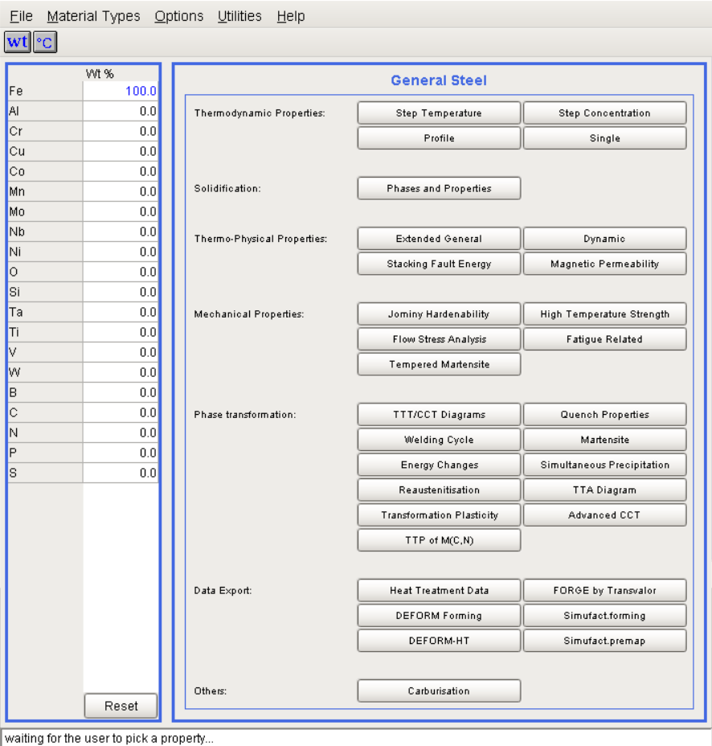
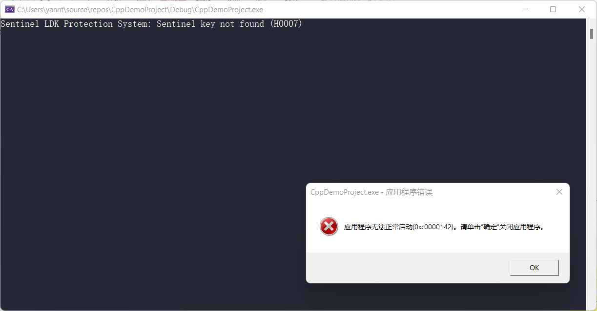

=================
JMatPro 二次开发
=================

JMatPro 是一个用于预测材料性能的软件。它可以基于预存于软件内部的专家经验规则来预测材料的物理性能，比如导热系数等。

JMatPro 主要用来做相图计算。包括平衡相图和非平衡相图。在使用软件时，一般按照如下步骤进行：

1. 选择数据库 Meterial Types
2. 设置合金成分（保存成分）
3. 设置窗口右侧参数
4. 按软件提示完成后续流程

针对连铸项目，因为中重院只购买了通用钢模块，所以我们仅考虑 General Steel 页面的相关功能。

软件计算结束后，基本上每个功能都可以用一张图来显示，这张图可以导出为 txt 文件，也可以到处为 png 格式。

2021年11月26日，经过讨论，发现 JMatPro 软件存在一些缺陷：

- 硅（Si）含量超过 3 后，无法计算凝固非平衡相图。需要确定在数学模型中有没有上下限的限制。
- 钢种规则库是有限的，对于新出现的成分，出现无法计算的情况。
- 凝固过程中的平衡相图和非平衡相图是一样的，这有违常识。

我们希望经过二次开发，实现\ **一键连铸**\ ，能够用一次鼠标点击操作，完成后续的操作。

从开始计算到控制 PLC 上位机一共需要 5 秒钟，因此，理想的并行计算速度和渲染时间应该控制在 3 秒左右。现在初步可供参考的思路有：

- 变网格划分，提高计算效率。温度变化大的地方更细致地划分。
- 只计算中间 1 维厚度方向的温度来确定喷水量，因为只有这个位置有喷嘴。如果有幅切，可以多计算两路厚度方向，确定两外两路喷嘴的喷水量。
- :math:`\Delta t` 确定收敛条件，不用每次都去计算，选择最小值即可。收敛条件是指对于一个晶粒来讲，其与四邻域不在发生热交换。热交换公式比较复杂，不再研究了，需要知道的是，这和 :math:`\Delta t` 有关。

跟中重院聊天时，他们不关心实现细节，只需要讲明白，用什么方法，效率提高了多少，代价是多少就可以了。

因为对计算速度有要求，可以考虑使用内存型数据库 Redis 来设计数据库的存储和交互。

甲方提问：网页的渲染速度不知到能不能办到，能不能实时获取信局部信息？

初始温度由中间包确定。可以实时获取。

设计出来的 UI 要能够展示单流、双流、三流的温度场。

需求包括：下发参数后，输入和输出怎么呈现，画面展示一下。计划做成什么样子，要跟甲方交流一下，方便确认需求是否正确。数据流程要完整，具体实现细节可以省略。

二次开发支持使用 C++ 或 Python 来调用官方的\ `开放接口 <https://www.sentesoftware.co.uk/jmatpro-api>`_\ 。

在配置环境时，若缺少加密狗，则无法继续完成后续工作，参考\ `JMatPro API 安装与开发环境配置指南 <https://kdocs.cn/l/cd3ZKiq03jt1>`_\ 。错误提示如下图所示：

