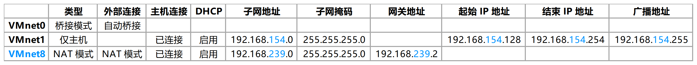
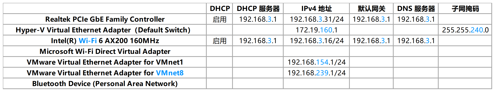

========================
虚拟机和宿主机之间的通信
========================

VMware 虚拟网络编辑器的配置信息
-------------------------------

物理机 ipconfig 网络配置信息
----------------------------

表格相关项的解释
----------------

- Realtek PCIe GbE Family Controller：网线/有线入网使用的协议。 `Ref <https://answers.microsoft.com/en-us/windows/forum/windows_7-networking/what-is-realtek-pcie-gbe-family-controller-why-it/5a6cdd17-155b-e011-8dfc-68b599b31bf5>`__
- Hyper-V：微软原生的虚拟机管理程序，它允许你在一台物理机上创建多个虚拟机，多个虚拟机之间相互独立，但是资源共享。
- Hyper-V Virtual Ethernet Adapter（Default Switch）：虚拟网络适配器，也叫 Virtual NIC 。可以看作是物理网络适配器的一个虚拟版本。它通过 LAN 连接一个物理服务器和多个 VM 或其他网络设备。简言之，它管理着所有的网络通信。每个 VM 都有一个或多个 vNIC ，它提供向子网的连接。你可以通过给 NIC 分配 IP 地址，让更多子网中的机器可以相互通信。 `Ref <https://www.nakivo.com/blog/hyper-v-network-adapters-what-why-and-how/>`__
- Intel(R) Wi-Fi 6 AX200 160MHz：WLAN/无线入网使用的协议
- Microsoft Wi-Fi Direct Virtual Adapter：主要用于创建无线热点。这项虚拟化技术把一个物理无线适配器转换为两个虚拟无线适配器。然后，你通过连接一个虚拟无线适配器到常规无线网络，并使用另一个虚拟适配器连接到另一个网络（例如 WiFi 热点），并让其他人像连接到普通 AP 一样无线连接到你的 Windows 机器。 `Ref <https://superuser.com/questions/1580417/what-is-microsoft-wi-fi-direct-virtual-adapter-used-for>`__
- VMware Virtual Ethernet Adapter for VMnet1：这是 Host-Only 网络模式，用于建立一个与世隔绝的网络环境。其中 VMnet1 是一个虚拟的交换机，交换机的一个端口连接到你的 Host 上，另外一个端口连接到虚拟的 DHCP 服务器上（实际上是 VMware 的一个组件），剩下的端口连到虚拟机上。虚拟网卡 VMnet1 作为虚拟机的网关接口，为虚拟机提供服务。在虚拟机启动之后，如果你用 ipconfig 命令，你会看到默认网关指向了 VMnet1 网卡的地址。（实际上它并不能提供路由，这是 VMware 设计使然，它是干除了提供路由之外的一些事情——实际上是我也不知道它干了什么事情），这里没有提供路由主要表现在没有提供 NAT 服务，使得虚拟机不可以访问 Host-Only 模式所指定的网段之外的地址。 `Ref <https://blog.csdn.net/u012110719/article/details/42318717>`__
- VMware Virtual Ethernet Adapter for VMnet8：这是 NAT 方式，是最简单的组网方式。VMnet8 是一张虚拟网卡。物理机使用 VMnet8 和虚拟机通信时，网卡和虚拟机的网关需要保持一致。虚拟网卡一个接口连接到虚拟的 NAT 服务器上（这也是一个VMware组件），一个接口连接到虚拟 DHCP 服务器，其他的接口连虚拟机。NAT 组网方式比 Host-Only 方式多了一个 NAT 服务。 `Ref <http://www.unixlinux.online/unixlinux/linuxgl/linuxjq/201703/77641.html>`__
- VMware Virtual Ethernet Adapter for VMnet0：实际上就是一个虚拟的网桥。这个网桥有很若干个端口，一个端口用于连接你的Host，一个端口用于连接你的虚拟机，他们的位置是对等的，谁也不是谁的网关。
- Bluetooth Device (Personal Area Network)：蓝牙网络连接

解释不充分及疑惑点
------------------

- LAN 是什么？
- 虚拟机和物理机并不处于同一个网段，为什么能够 ping 通呢？
- Window Host 机器创建热点后，其他设备上网，是通过 Windows 的网络上网呢，还是通过适配器上网呢？
- DHCP 服务器的地址怎么看？DHCP 服务器的作用是什么？
- 网关接口是用来上网的吗？还是网关接口把现有的几台机器变换到另一个 IP 地址下，通过另一个 IP 地址接入网络，然后其他机器通过和另一个 IP 地址通信，进而访问互联网。（这里的另一个 IP 地址属于互联网）
- 如何查看 VMnet1 和 VMnet8 网卡的地址？
- 网络地址中的最后一段 0、1、255 分别由有什么作用？
- 网桥是不是也叫做交换机？不是。在局域网连接各个子网的时候，交换机相当于多个网桥，具备存储转发功能，可以将网络进行物理分段。
- NAT 方式如何让处于不同网段的机器互相通信的？ [ `Ref <https://zhuanlan.zhihu.com/p/72895574>`__ ]
- 什么是子网 IP 地址？作用是什么？
- 网卡和交换机有什么区别？网卡也叫网络适配器（Network Adapter），看适配器的名字，望文生义，就是把不同的接口，都组装到要给中间部件上，让各个部件之间可以通过适配器互相连接起来。 `Ref <http://blog.itpub.net/28624388/viewspace-2214358/>`_

虚拟机克隆
----------

如果使用 VMware 的虚拟机克隆方法，两台主机需要通信，则需要修改克隆机的：

- IP Address `Ref <https://linuxconfig.org/how-to-configure-static-ip-address-on-ubuntu-18-10-cosmic-cuttlefish-linux>`__
- MAC Address 直接删除（重启后会自动生成），或参考 `Ref <https://www.howtogeek.com/192173/how-and-why-to-change-your-mac-address-on-windows-linux-and-mac/>`__ 手工分配硬件地址。
- UUID 直接删除（重启后会自动生成），或参考 `Ref <https://www.howtogeek.com/192173/how-and-why-to-change-your-mac-address-on-windows-linux-and-mac/>`__ 手工指定 UUID 。
- hostname（在网络中可以看见的主机名字） `Ref <https://phoenixnap.com/kb/ubuntu-20-04-change-hostname>`__
- 虚拟机的网卡信息 `Ref <https://phoenixnap.com/kb/ubuntu-20-04-change-hostname>`__
- 在需要相互访问的物理机和虚拟机的 /etc/hosts 中分别添加 IP 其他主机的地址映射，格式为 IPAddress hostname，作用是 ping hostname 是能成功
